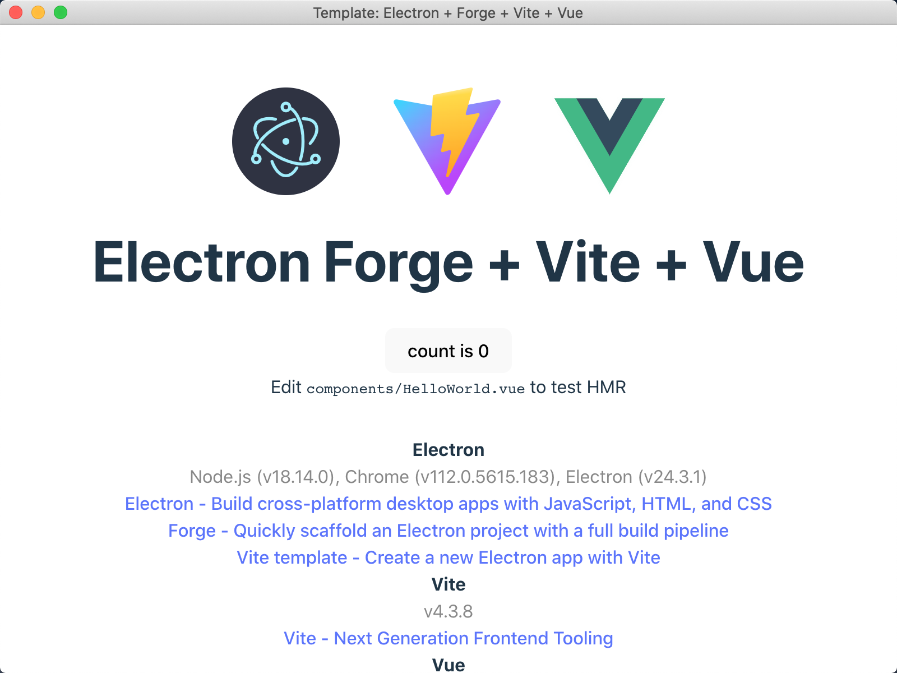

# template-electronforge-vite-vue

一个可用的“Electron Forge + Vite + Vue3”模版。

An available 'Electron Forge + Vite + Vue3' template.

## 为什么？

- Electron

  既能快速开发出主流操作系统的APP又只会写html+css+javascript，那Electron无疑满足需求。至于性能问题，2023年这个时点+V8引擎，哪台电脑不能流畅运行个web页面？

- Forge

  Electron官方推荐的打包工具，且已经退出了官方脚手架，省得折腾。

- Vite

  构建速度快。

- Vue3

  喜欢。

## 开始

一层一层来搭建这个项目。

### #1 Electron+Forge+Vite

Electron Forge官方提供了一个脚手架，且自带Vite模版。 [Vite - Electron Forge](https://www.electronforge.io/templates/vite)

```
npm init electron-app@latest my-new-app -- --template=vite
```

### #2 +Vue

Electron Forge的文档中有关于Vue2的添加说明，可以作为参考。[Vue 2 - Electron Forge](https://www.electronforge.io/guides/framework-integration/vue-2)

1. 添加vue依赖

```
npm install --save vue
```

2. 修改Vite配置

脚手架生成的Vite配置文件有三个，分别是vite.main.config.mjs、vite.reload.config.mjs和vite.renderer.config.mjs。这里修改==vite.renderer.config.mjs==如下。

```
import { defineConfig } from 'vite';
import vue from '@vitejs/plugin-vue'

// https://vitejs.dev/config
export default defineConfig({
  plugins: [vue()],
});
```

3. index.html中加入注入口

添加vue启动代码。众所周知，Electron运行时分成了main和renderer两个线程，将系统侧逻辑与渲染逻辑彻底分开，所以应该在渲染代码这边添加vue启动代码。

脚手架生成的==index.html==如下。

```
<!DOCTYPE html>
<html>
  <head>
    <meta charset="UTF-8" />
    <title>Template: Electron + Forge + Vite + Vue</title>

  </head>
  <body>
    <div id="app"></div>
    <script type="module" src="/src/renderer.js"></script>
  </body>
</html>
```

添加==<div id="app"></div>==用于注入Vue实例。

4. renderer中加入启动代码

这个==renderer.js==则认为是渲染侧的js入口，在这里面添加即可，如下。

```
import { createApp } from 'vue'
import App from './App.vue'
import './style.css'

createApp(App).mount('#app')
```

App.vue、style.css都是直接从Vue的方法脚手架生成的Hello World示例中拷贝过来的，用来示意。

### #3 启动

这时==package.json==应该有如下配置，没有就加进去。

```
{
  "scripts": {
    "start": "electron-forge start"
  }
}
```

在项目根目录下运行如下命令启动项目。

```
npm run start
```

启动相应如下。


效果如图。

